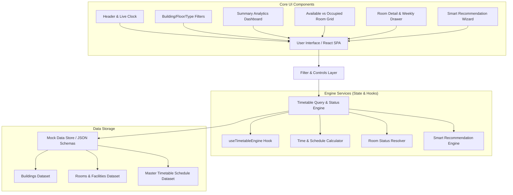

# 🏗️ Technical Architecture Document — Classroom & Lab Availability Finder (`architecture.md`)

## 📐 1. System Architecture Overview

The **Classroom & Lab Availability Finder** (`CampusSpace / RoomRadar`) is designed as a high-performance, timetable-driven client-side application built with **React**, **TypeScript**, and **Vite**.



---

## 🧩 2. Application Component Architecture

### Component Hierarchy

```text
src/
├── components/
│   ├── layout/
│   │   ├── Header.tsx                # App title, live clock, theme toggle
│   │   ├── Footer.tsx                # Footer info & quick stats
│   │   └── AnalyticsBanner.tsx       # Quick status counters (Free, Occupied, Labs Free)
│   ├── filters/
│   │   ├── ControlPanel.tsx          # Main filter wrapper
│   │   ├── DayTimeSelector.tsx       # Live vs Custom day/time picker
│   │   ├── BuildingFloorFilter.tsx   # Building dropdown & Floor tabs
│   │   └── RoomTypeFilter.tsx        # All vs Classrooms vs Labs filter buttons
│   ├── rooms/
│   │   ├── RoomGrid.tsx              # Grid container displaying room cards
│   │   ├── RoomCard.tsx              # Card showing status, name, capacity, class info
│   │   ├── AvailableRoomCard.tsx     # Card specific to free rooms (green indicator)
│   │   ├── OccupiedRoomCard.tsx      # Card with ongoing class & instructor info (red indicator)
│   │   └── ScheduledClassBadge.tsx   # Subject, instructor & duration info block
│   ├── modals/
│   │   ├── RoomDetailDrawer.tsx      # Slide-out drawer with detailed specs & upcoming slots
│   │   ├── WeeklyTimetableModal.tsx  # Full week schedule matrix for selected room
│   │   └── RecommendationModal.tsx   # Smart wizard for finding optimal free room
│   └── common/
│       ├── Badge.tsx                 # Status & type tags
│       ├── Icon.tsx                  # System icon wrappers
│       └── SearchBar.tsx             # Faculty & Subject search input
```

---

## 💾 3. Data Schema & Types (`src/types/index.ts`)

```typescript
// Room Type Classification
export type RoomType = 'classroom' | 'computer_lab' | 'science_lab' | 'seminar_hall';

// Days of the academic week
export type DayOfWeek = 'Monday' | 'Tuesday' | 'Wednesday' | 'Thursday' | 'Friday' | 'Saturday';

// Room Amenities & Capacity
export interface Amenities {
  seatingCapacity: number;
  hasProjector: boolean;
  hasAC: boolean;
  hasWhiteboard: boolean;
  computerCount?: number;
  powerOutlets: boolean;
}

// Room Metadata Structure
export interface Room {
  id: string;
  name: string;           // e.g., "Lab 302", "CR-101"
  code: string;           // e.g., "ENG-302"
  buildingId: string;
  buildingName: string;   // e.g., "Engineering Block"
  floor: number;          // 0 = Ground, 1 = 1st Floor, etc.
  type: RoomType;
  amenities: Amenities;
}

// Timetable Schedule Entry
export interface ScheduleSlot {
  id: string;
  roomId: string;
  dayOfWeek: DayOfWeek;
  startTime: string;      // 24hr format "09:00"
  endTime: string;        // 24hr format "10:00"
  subjectCode: string;    // e.g., "CS201"
  subjectName: string;    // e.g., "Data Structures & Algorithms"
  facultyName: string;    // e.g., "Dr. A. Sharma"
  batch: string;          // e.g., "CSE-2A"
}

// Calculated Status for Selected Day & Time
export interface RoomStatusResult {
  room: Room;
  isAvailable: boolean;
  currentSchedule?: ScheduleSlot;
  nextSchedule?: ScheduleSlot;
  freeUntil?: string;           // e.g., "14:00"
  nextAvailableTime?: string;   // e.g., "11:00" (if occupied)
  availableDurationMins?: number;
}

// User Selection Filters
export interface FilterState {
  isLiveMode: boolean;
  selectedDay: DayOfWeek;
  selectedTime: string;         // 24hr format "10:30"
  selectedBuilding: string;     // 'all' or buildingId
  selectedFloor: number | 'all';
  selectedType: RoomType | 'all';
  searchQuery: string;          // Faculty or subject search
}
```

---

## ⚙️ 4. Core Query & Calculation Engine

### 4.1 Room Availability Resolver (`src/utils/timetableEngine.ts`)

The availability algorithm parses military time strings into total minutes from midnight for high-speed evaluation:

```typescript
/**
 * Converts "HH:MM" time string to minutes past midnight
 */
export function timeToMinutes(timeStr: string): number {
  const [hours, minutes] = timeStr.split(':').map(Number);
  return hours * 60 + minutes;
}

/**
 * Determines room status for a given day and target time
 */
export function evaluateRoomStatus(
  room: Room,
  schedules: ScheduleSlot[],
  day: DayOfWeek,
  targetTime: string
): RoomStatusResult {
  const targetMins = timeToMinutes(targetTime);

  // Filter schedule slots for target room and day, sorted by start time
  const roomSlots = schedules
    .filter(s => s.roomId === room.id && s.dayOfWeek === day)
    .sort((a, b) => timeToMinutes(a.startTime) - timeToMinutes(b.startTime));

  // Find active ongoing schedule
  const activeSlot = roomSlots.find(s => {
    const startMins = timeToMinutes(s.startTime);
    const endMins = timeToMinutes(s.endTime);
    return targetMins >= startMins && targetMins < endMins;
  });

  if (activeSlot) {
    // Room is OCCUPIED
    const nextFreeMins = timeToMinutes(activeSlot.endTime);
    return {
      room,
      isAvailable: false,
      currentSchedule: activeSlot,
      nextAvailableTime: activeSlot.endTime,
    };
  }

  // Room is AVAILABLE — Calculate free until duration
  const upcomingSlots = roomSlots.filter(s => timeToMinutes(s.startTime) > targetMins);
  const nextSlot = upcomingSlots[0];
  
  const freeUntil = nextSlot ? nextSlot.startTime : '17:30'; // Academic day end
  const freeUntilMins = timeToMinutes(freeUntil);
  const availableDurationMins = Math.max(0, freeUntilMins - targetMins);

  return {
    room,
    isAvailable: true,
    nextSchedule: nextSlot,
    freeUntil,
    availableDurationMins,
  };
}
```

---

## 🧠 5. Smart Free-Room Recommendation Algorithm

For students seeking immediate space, the recommendation engine scores rooms based on criteria weights:

```text
Score = (FreeDurationWeight * DurationMinutes) 
        + (TypeMatchWeight * 50) 
        + (CapacityMatchWeight * 30) 
        - (FloorPenalty * FloorDifference)
```

1. **Duration:** Longest uninterrupted free window scores highest.
2. **Type:** Exact match for lab (if user needs computers/lab equipment).
3. **Proximity:** Rooms on ground/lower floors score higher to minimize walking distance.

---

## 🎨 6. UI State Flow & Interactive Wireframe Layout

```text
+-----------------------------------------------------------------------------------+
|  🏫 CampusSpace | 🔴 LIVE CLOCK: Mon 10:15 AM | ☀️ Light / 🌙 Dark Toggle        |
+-----------------------------------------------------------------------------------+
|  🔍 SEARCH: [ Faculty / Subject... ]   📅 DAY: [ Monday v ]   ⏰ TIME: [ 10:15 v ]|
|  🏢 BUILDING: [ All Blocks v ]         📶 FLOOR: [ All | G | 1 | 2 | 3 ]       |
|  🏷️ TYPE: [ All | 📖 Classrooms | 💻 Computer Labs | 🔬 Science Labs ]          |
+-----------------------------------------------------------------------------------+
|  📊 SUMMARY: Total: 32 | 🟢 Free Now: 18 | 🔴 Occupied: 14 | 💻 Free Labs: 5    |
+-----------------------------------------------------------------------------------+
|  🟢 AVAILABLE ROOMS (18)                    | 🔴 OCCUPIED ROOMS (14)              |
|  +---------------------------------------+  | +---------------------------------+ |
|  | 📖 CR-101 (Ground Floor) - FREE        |  | | 💻 Lab 302 (3rd Floor) - BUSY   | |
|  | Capacity: 60 Seats | Projector: Yes   |  | | CS201: Data Structures          | |
|  | 🟢 Free until: 01:00 PM (165 mins left) |  | | Dr. A. Sharma | CSE 2nd Yr      | |
|  | [ View Schedule ] [ Reserve Info ]    |  | | 🔴 Free at: 11:30 AM (In 45m)  | |
|  +---------------------------------------+  | +---------------------------------+ |
+-----------------------------------------------------------------------------------+
```

---

## 📂 7. Proposed Directory Structure in `my-react-app`

```text
my-react-app/
├── public/
│   └── favicon.svg
├── src/
│   ├── assets/
│   ├── components/
│   │   ├── layout/
│   │   ├── filters/
│   │   ├── rooms/
│   │   ├── modals/
│   │   └── common/
│   ├── data/
│   │   ├── mockBuildings.ts
│   │   ├── mockRooms.ts
│   │   └── mockSchedules.ts
│   ├── hooks/
│   │   ├── useTimetableEngine.ts
│   │   └── useLiveTime.ts
│   ├── types/
│   │   └── index.ts
│   ├── utils/
│   │   ├── timetableEngine.ts
│   │   └── timeHelpers.ts
│   ├── App.tsx
│   ├── App.css
│   ├── index.css
│   └── main.tsx
├── architecture.md
├── idea.md
├── package.json
└── vite.config.ts
```

---

## 🚀 8. Non-Functional Requirements (Performance & Scalability)

- **Execution Speed:** Client-side evaluation time under **5ms** for 500+ schedule slots.
- **Offline Reliability:** Instant performance via local mock dataset without server bottlenecks.
- **Responsiveness:** Fluid UI layout across Mobile, Tablet, and Desktop screens using CSS Grid/Flexbox.
- **Accessibility:** High contrast badges for Available (`#10B981`) and Occupied (`#F43F5E`) statuses with distinct icon markers.
