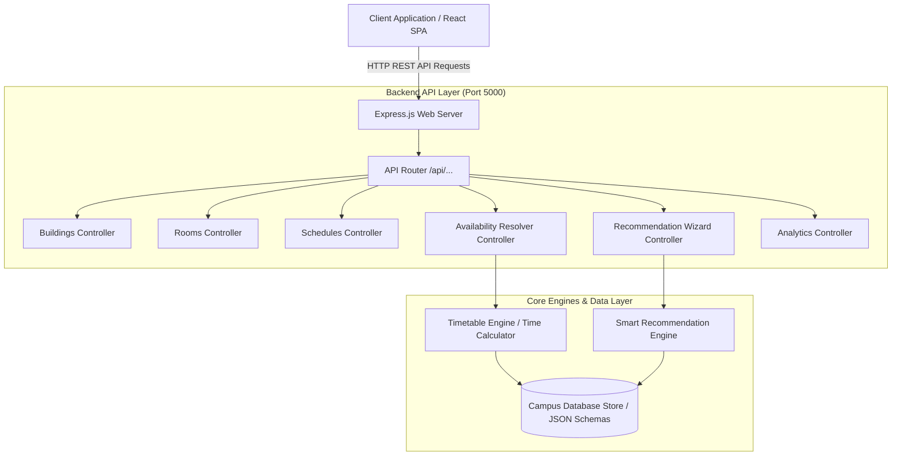

# ⚙️ CampusSpace / RoomRadar — Backend Technical Specification (`backend.md`)

## 📌 1. System Architecture Overview

The **CampusSpace / RoomRadar** backend is built as a lightweight, high-performance RESTful API service using **Node.js** and **Express.js**. It exposes endpoints for campus building metadata, room specifications, weekly master timetables, real-time room availability status resolution, analytics metrics, and smart room recommendations.



---

## 💾 2. Data Models & JSON Schemas

### 2.1 Building Schema (`Building`)
```json
{
  "id": "bld-eng",
  "name": "Engineering Block",
  "code": "ENG",
  "totalFloors": 4
}
```

### 2.2 Room Schema (`Room`)
```json
{
  "id": "room-eng-201",
  "name": "Computer Lab 201",
  "code": "ENG-LAB-201",
  "buildingId": "bld-eng",
  "buildingName": "Engineering Block",
  "floor": 2,
  "type": "computer_lab",
  "amenities": {
    "seatingCapacity": 45,
    "hasProjector": true,
    "hasAC": true,
    "hasWhiteboard": true,
    "computerCount": 45,
    "powerOutlets": true
  }
}
```

### 2.3 Schedule Slot Schema (`ScheduleSlot`)
```json
{
  "id": "sch-1",
  "roomId": "room-eng-101",
  "dayOfWeek": "Monday",
  "startTime": "09:00",
  "endTime": "11:00",
  "subjectCode": "CS201",
  "subjectName": "Data Structures & Algorithms",
  "facultyName": "Dr. A. Sharma",
  "batch": "CSE-2A"
}
```

---

## 🚀 3. REST API Endpoint Specification

### 1. `GET /api/buildings`
Returns list of all campus academic blocks.

- **Response `200 OK`**:
```json
[
  { "id": "bld-eng", "name": "Engineering Block", "code": "ENG", "totalFloors": 4 },
  { "id": "bld-mab", "name": "Main Academic Building", "code": "MAB", "totalFloors": 4 }
]
```

---

### 2. `GET /api/rooms`
Returns list of rooms with optional filtering parameters.

- **Query Parameters**:
  - `buildingId` (optional): Filter by building ID (`bld-eng`, `all`)
  - `floor` (optional): Filter by floor level (`0`, `1`, `2`, `3`, `all`)
  - `type` (optional): Filter by room type (`classroom`, `computer_lab`, `science_lab`, `seminar_hall`, `all`)

- **Response `200 OK`**: Array of `Room` objects.

---

### 3. `GET /api/schedules`
Returns master weekly timetable entries.

- **Query Parameters**:
  - `roomId` (optional): Filter by specific room ID
  - `day` (optional): Filter by day of week (`Monday` to `Saturday`)

- **Response `200 OK`**: Array of `ScheduleSlot` objects.

---

### 4. `GET /api/availability`
Calculates real-time availability status for all rooms based on target day and time.

- **Query Parameters**:
  - `day` (required): Day of week (`Monday`, `Tuesday`, etc.)
  - `time` (required): 24-hour military time string (`09:30`, `14:15`)
  - `buildingId` (optional): Filter by building ID
  - `floor` (optional): Filter by floor level
  - `type` (optional): Filter by room type
  - `q` (optional): Search query matching faculty, subject code, batch, or room name

- **Response `200 OK`**:
```json
{
  "activeDay": "Monday",
  "activeTime": "10:15",
  "totalRooms": 20,
  "statuses": [
    {
      "room": { "id": "room-eng-101", "name": "CR-101", "buildingName": "Engineering Block", "floor": 1, "type": "classroom" },
      "isAvailable": false,
      "currentSchedule": {
        "subjectCode": "CS201",
        "subjectName": "Data Structures & Algorithms",
        "facultyName": "Dr. A. Sharma",
        "batch": "CSE-2A",
        "startTime": "09:00",
        "endTime": "11:00"
      },
      "nextAvailableTime": "11:00"
    },
    {
      "room": { "id": "room-eng-102", "name": "CR-102", "buildingName": "Engineering Block", "floor": 1, "type": "classroom" },
      "isAvailable": true,
      "freeUntil": "17:30",
      "availableDurationMins": 435
    }
  ]
}
```

---

### 5. `POST /api/recommend`
Evaluates user requirements and generates ranked free room recommendations.

- **Request Body**:
```json
{
  "purpose": "lab",
  "groupSize": "small",
  "buildingId": "all",
  "needComputers": true,
  "needProjector": true,
  "day": "Monday",
  "time": "10:15"
}
```

- **Response `200 OK`**:
```json
{
  "count": 3,
  "recommendations": [
    {
      "roomStatus": { ... },
      "score": 190,
      "matchReasons": [
        "Free for 2h 15m uninterrupted",
        "Equipped lab facility for practical work",
        "Has 45 desktop PCs",
        "HD Projector / Smart Board available"
      ]
    }
  ]
}
```

---

### 6. `GET /api/analytics`
Returns aggregate status metrics for the campus.

- **Query Parameters**: `day`, `time`
- **Response `200 OK`**:
```json
{
  "total": 20,
  "available": 12,
  "occupied": 8,
  "freeComputerLabs": 4,
  "freeSeminarHalls": 2
}
```

---

## 🧮 4. Core Availability Resolver Logic

The availability algorithm converts military time strings `"HH:MM"` into total minutes past midnight for high-speed linear comparison ($O(1)$ per room slot evaluation):

$$t_{\text{mins}} = \text{hours} \times 60 + \text{minutes}$$

```javascript
function evaluateRoomStatus(room, schedules, day, targetTime) {
  const targetMins = timeToMinutes(targetTime);
  const roomSlots = schedules
    .filter(s => s.roomId === room.id && s.dayOfWeek === day)
    .sort((a, b) => timeToMinutes(a.startTime) - timeToMinutes(b.startTime));

  // Check ongoing session
  const activeSlot = roomSlots.find(s => {
    const startMins = timeToMinutes(s.startTime);
    const endMins = timeToMinutes(s.endTime);
    return targetMins >= startMins && targetMins < endMins;
  });

  if (activeSlot) {
    return {
      room,
      isAvailable: false,
      currentSchedule: activeSlot,
      nextAvailableTime: activeSlot.endTime
    };
  }

  // Room is AVAILABLE
  const upcomingSlot = roomSlots.find(s => timeToMinutes(s.startTime) > targetMins);
  const freeUntil = upcomingSlot ? upcomingSlot.startTime : '17:30';
  const availableDurationMins = timeToMinutes(freeUntil) - targetMins;

  return {
    room,
    isAvailable: true,
    nextSchedule: upcomingSlot,
    freeUntil,
    availableDurationMins
  };
}
```

---

## 🛠️ 5. Installation & Execution Guide

### Prerequisites
- Node.js `v18+` or `v20+`

### Setup Steps
```bash
cd backend
npm install
npm start
```
The server will start listening on `http://localhost:5000`.
